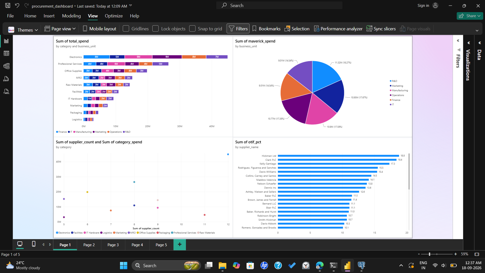
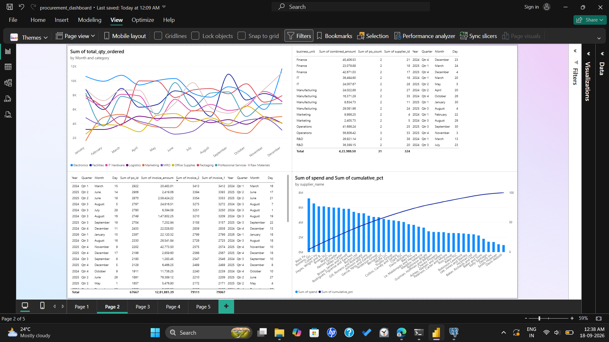
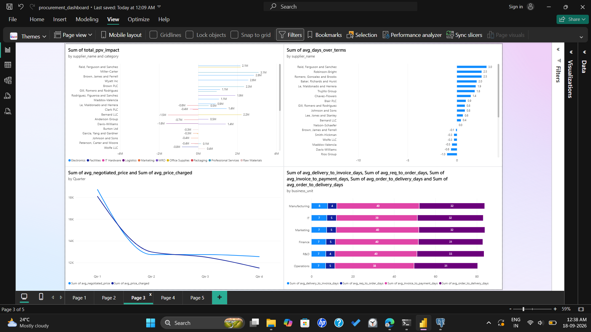
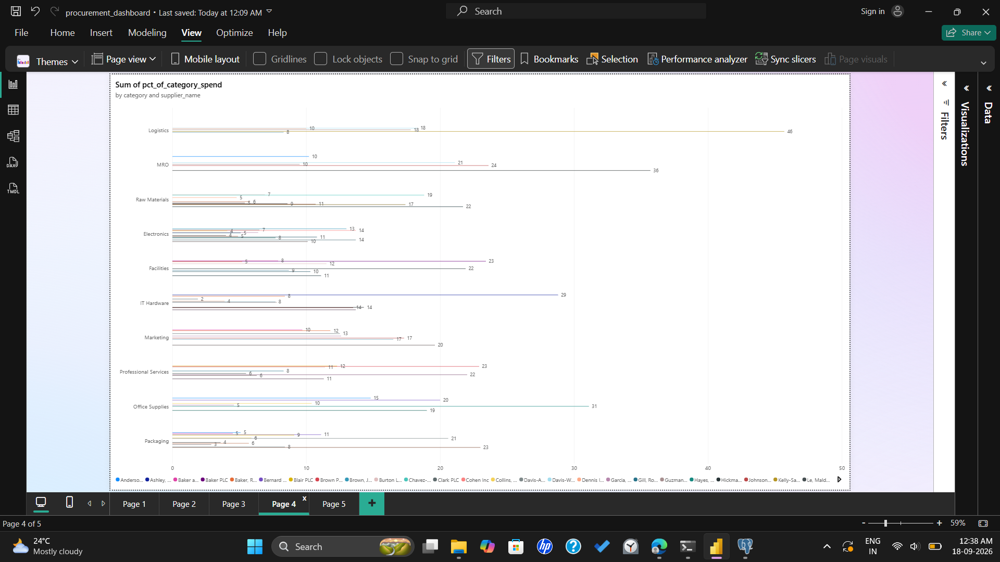
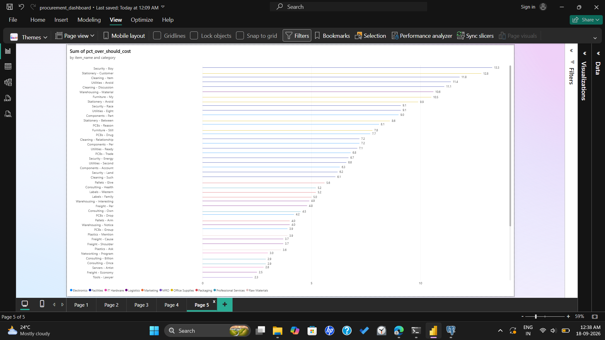

# Procurement Analytics Pipeline

A full-stack procurement analytics project: **Python (generate/clean) → PostgreSQL (relational model) → Power BI (dashboard)**.

Covers 13 procurement analysis types on a synthetic but realistic dataset with deliberately injected anomalies (maverick spend, price variance, late/partial deliveries, duplicate invoices, split purchase orders).

## Architecture

```
Python (data_generation/generate_data.py)
    → generates 6 related CSVs into data/
PostgreSQL (load_data.py + sql/schema.sql)
    → loads CSVs into a fact/dimension schema
SQL (sql/analysis_queries.sql, sql/views.sql)
    → one query/view per analysis type
Power BI (powerbi/procurement_dashboard.pbix)
    → dashboard built on the exported views (exports/*.csv)
```

## Schema

**Dimensions** (describe a business object, rarely change): `suppliers`, `items`, `contracts`
**Facts** (events with numbers to aggregate): `purchase_orders`, `deliveries`, `invoices`

`purchase_orders.contract_id` is nullable by design — an order with no linked contract is the maverick-spend signal. `deliveries` and `invoices` are children of `purchase_orders` (one order can have multiple partial shipments or installment payments).

## Analysis types covered

Spend analysis, ABC/Pareto, supplier OTIF performance, purchase price variance (PPV), maverick spend/contract compliance, savings tracking, Kraljic supplier segmentation, supplier concentration/risk, DPO/payment terms, cycle time, should-cost modeling, demand forecasting input, and anomaly detection (duplicate invoices, split POs).

## Dashboard

**Page 1 — Spend & Compliance** (spend by category/BU, maverick spend, Kraljic segmentation, supplier OTIF)


**Page 2 — Demand & Anomalies** (monthly demand by category, split-PO candidates, duplicate invoices, ABC/Pareto)


**Page 3 — Pricing & Risk** (PPV, DPO, savings tracking, cycle time)


**Page 4 — Supplier Concentration** (single-source risk by category)


**Page 5 — Should-Cost Benchmark** (actual price vs. should-cost, by item)


## Key findings

- **Contract bypass is systemic:** 34.8% of orders (39.7% of value, ₹6.20 Cr) have no linked contract, spread evenly across all six business units rather than concentrated in one.
- **Contracted spend still leaks value:** ₹4.32 Cr in cumulative overpayment above negotiated benchmarks, on orders that *do* have a contract — pricing isn't enforced at the point of purchase.
- **On-time delivery, not quantity or quality, is the weak link:** composite OTIF averages 10.3%, but in-full delivery is healthy (90.0%) — the failure is concentrated in on-time delivery (20.1%).
- **₹17.06 Lakh flagged for AP audit:** 44 duplicate invoice pairs (₹12.82 L) and 15 same-day/same-supplier order clusters just under a common approval threshold (₹4.24 L).
- **Supplier concentration is currently healthy:** no category has a single supplier holding more than 50% of its spend.

## Recommendations

1. **Enforce contract routing at the point of purchase.** Maverick spend is spread evenly across business units, so this needs a system-level fix (block/flag PO creation with no matching active contract), not a department-specific one.
2. **Add automated price checks against the negotiated benchmark.** A contract existing isn't enough — flag or block unit prices above the negotiated rate at PO entry, not in a quarterly report after the fact.
3. **Renegotiate delivery-date commitments before switching suppliers.** In-full and quality rates are both stronger than on-time rate — align requested delivery dates with what suppliers can realistically hit, starting with the worst OTIF performers.
4. **Run a targeted should-cost review on the Facilities category**, where security/cleaning items show the largest overrun percentages of any category.
5. **Route flagged duplicate invoices and split-PO clusters to accounts-payable audit** — these are leads for human review, not proof of fraud.
6. **No immediate action needed on supplier concentration** — continue monitoring as spend grows.

A full write-up with the Python code, SQL queries, and reasoning behind each finding is in `Procurement-Analytics-Report.pdf` (generated from this project, not included in this repo).

## Running it

```bash
cd data_generation
python -m venv ../venv && source ../venv/Scripts/activate
pip install -r ../requirements.txt
python generate_data.py

cd ..
PGUSER=postgres PGPASSWORD=yourpassword PGHOST=localhost PGPORT=5433 PGDATABASE=procurement_analysis python load_data.py
```

Then open `powerbi/procurement_dashboard.pbix` in Power BI Desktop, or run the queries in `sql/analysis_queries.sql` directly against the database.
